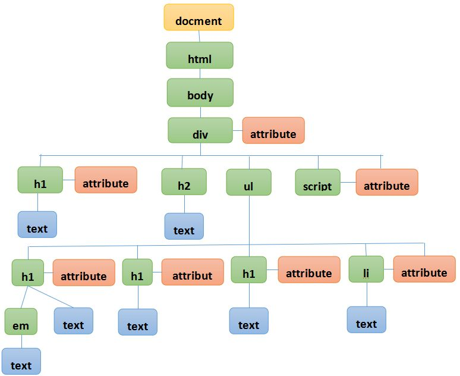

什么是DOM？
---
DOM是Document Object Model（文档对象模型）

DOM是一种API(应用编程接口)
W3C对DOM的定义是：“一个与系统平台和编程语言无关的接口，程序和脚本可以通过这个接口动态地访问和修改文档的内容、结构、样式。”
当创建了一个网页并把他加载到Web浏览器中，DOM将编写的网页文档转换成了一个文档对象。

对象
---
JavaScript的对象可以分为三种类型。

用户定义对象（user-defined object）：自己创建的对象。
内建对象（native object）：内建在JavaScript语言中的对象。
宿主对象（host object）：由浏览器提供的对象。


模型
---

用简单点的方法说，DOM将网页转变成一个对象模型，而这个模型就像一个树形的族谱。
用parent（父）、child（子）、sibling（兄弟）来表示家族的成员。
例如 html文件是整个家族的根源的话，它可以分为 head 分支和 body 分支，那么 head 中的meta 和 title 就是兄弟关系而 head 就是它的 父辈。
把这些元素看成点连起来，我们就可以把一个网络想象成由各种各样的节点连接而成的。


获取元素节点
---
getElementById
获取ID属性值的节点。
getElementsByTagName
获取某个标签的所有节点，由单复数可以看出，该方法返回的是一个对象数组。
getElementsByClassName
获取同一Class（类）的元素。
H5标准支持这种方法，在老的浏览器环境中可以通过函数实现相同功能。
```CPP
function getElementsByClassName(node,classname)/**node为搜索的起点，class为类名**/
if(node.getElementsByClassName){
ruturn node.getElementsByClassname/**原有方法有效使用原有方法**/
}else{
var results = new Array();/**定义一个“结果”为新数组**/
var elems = node.getElementsByTagName("*");/**把所有元素提取到elems**/
for ( var i=0; i<elems.length ; i++ ) {
 if (elems[i].classname.indexof(classname) !=-1)
  results[results.length] = elems[i]; /**输出所有的相应classname的元素到results*/
   }
  }
return results;
 }
}
```

获取后设置属性
---
getAttribute
获取指定的属性名的属性值
setAttribute
修改属性节点的值

值得注意的是；通过这种方法修改属性的值后，通过浏览器查看源代码仍然是改变前的值。
DOM的工作模式是先加载文档的静态内容，再动态刷新。如此而来就不需要通过刷新浏览器页面来看到改变的内容了。
